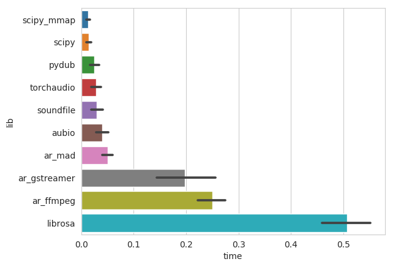
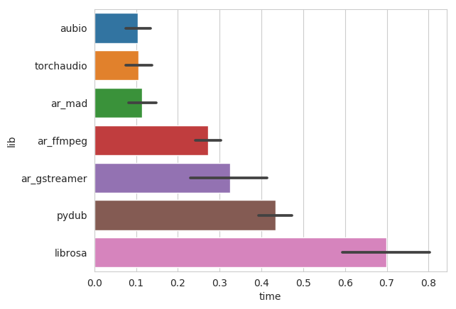
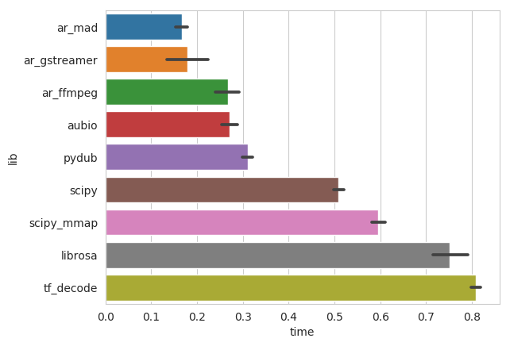
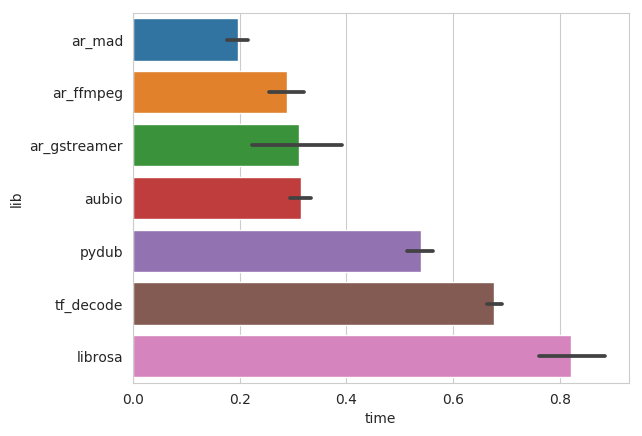

# Python Audio-Loading Benchmark

Today, machine learning models for audio often work with raw (time domain) audio. With large datasets, users typically load the audio file when assembling the batch on the fly. Therefore it is important to load audio as quickly as possible.

## Libraries

| Library                 | Short-Name  | Out Type  | Supported codecs  | Excerpts/Seeking |
|-------------------------|-----------------------|-------------------|-------------------| -------------------|-------|
| scipy.io.wavfile        | [`scipy`](loader.py)       | Native/Numpy      | PCM (only 16 bit)   | ❌ |
| scipy.io.wavfile memmap | [`scipy_mmap`](loader.py)  | Native/Numpy      | PCM (only 16 bit)   | ✅ |
| soundfile               | [`soundfile`](loader.py)   | CFFI              | PCM, Ogg, Flac | ✅ |
| pydub               | [`pydub`](loader.py) | Python Array           |  PCM, MP3, OGG or other ffmpeg/avconv supported codec | ❌ |
| aubio               | [`aubio`](loader.py) | Numpy Array | PCM, MP3, OGG or other avconv supported code |  ✅ |
| audioread           | [`ar_mad`](loader.py) | Numpy Array | ffmpeg | ✅ |
| audioread           | [`ar_gstreamer`](loader.py) | Numpy Array | ffmpeg | ✅ |
| audioread           | [`ar_ffmpeg`](loader.py) | Numpy Array | ffmpeg | ✅ |
| librosa             | [`librosa`](loader.py) | Numpy Array | relies in audioread |  ✅ |
| tensorflow 1.8 decode | [`tf_decode`](loader.py) | Tensorflow Tensor | All codecs supported by FFMPEG |  ✅ |
| torchaudio | [`torchaudio`](loader.py) | PyTorch Tensor | all codecs supported by Sox |  ✅ |

## Libraries not tested

* python wav
* audioread coreaudio
* madmom: same ffmpeg interface as `ar_ffmpeg`
* tensorflow 2.0

## Numpy

### WAV/PCM

### MP3

## PyTorch

### WAV/PCM

### MP3

## Tensorflow

### WAV/PCM

### MP3

## Running the Benchmark

### Installation using Docker

Build the docker container using `docker build -t audio_benchmark .`, it installs all the package requirements for all audio libraries.

### Generate sample data

To test the loading speed, we generate different durations of random (noise) audio data and encode it either to __PCM 16bit WAV__, __MP3 CBR__, or __MP4__.
The data is generated by using a shell script. To generate the data in the folder `AUDIO`, run `generate_audio.sh`.

### Start Benchmark

Mount the data directory into the docker container and run `run.sh` inside the container.

