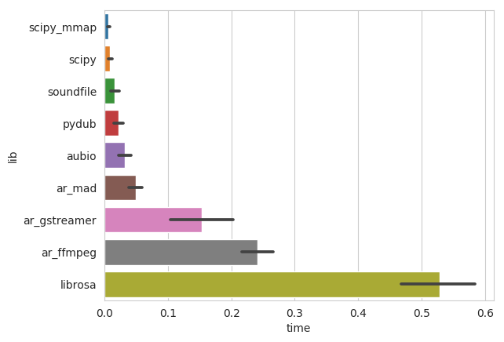
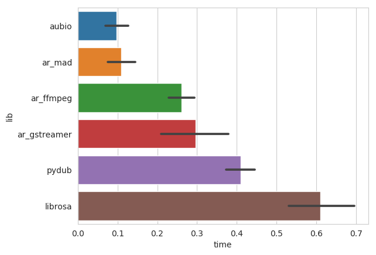

# Python Audio-Loading Benchmark

| Library                 | Loader Function Name  | Output Type       | Python Interface  | Supported formats  |
|-------------------------|-----------------------|-------------------|-------------------| -------------------|
| scipy.io.wavfile        | [`scipy`](loader.py)  | Numpy Array       | Native/Numpy      | WAV/PCM (16 bit)   |
| scipy.io.wavfile memmap | [`scipy_mmap`](loader.py) | Numpy Mem Map | Native/Numpy      | WAV/PCM (16 bit)   |
| soundfile               | [`soundfile`](loader.py) | Numpy Array    | CFFI              | WAV/PCM, Ogg, Flac |
| pydub               | [`pydub`](loader.py) | Python Array    | Native for WAV, Converting with ffmpeg for others | WAV/PCM, Ogg, Flac |

## Results

### WAV/PCM

### MP3

## Audio Loading landscape

### `scipy.io`

* __Supported formats:__ wav

#### Pros

* builtin, no installation necessary
* fast
* supports memory mapping

#### Cons

* does not scale the data to `[-1, 1]`, hence to read a 16 bit PCM wav file [manual scaling is necessary](https://github.com/faroit/audio_loading_benchmark/blob/eef11d2938d153cfa9981db155822df47edb6b8c/loaders.py#L57)
* does not support any other formats than PCM 16 bit (e.g. 24bit PCM)

### `audioread`

    1. wav read
    rawread
    try:
        return rawread.RawAudioFile(path)
    except DecodeError:
        pass

    # Core Audio.
    if _ca_available():
        from . import macca
        try:
            return macca.ExtAudioFile(path)
        except DecodeError:
            pass

    # GStreamer.
    if _gst_available():
        from . import gstdec
        try:
            return gstdec.GstAudioFile(path)
        except DecodeError:
            pass

    # MAD.
    if _mad_available():
        from . import maddec
        try:
            return maddec.MadAudioFile(path)
        except DecodeError:
            pass

    # FFmpeg.
    from . import ffdec
    try:
        return ffdec.FFmpegAudioFile(path)
    except DecodeError:
        pass

## Installation using Docker

* build the docker container using `docker build -t audio_benchmark .`
* wait

## Generate sample data

To test the loading speed, we generate different durations of random (noise) audio data and encode it either was __PCM 16bit WAV__, __MP3 CBR__, __MP4__.
The data is generated by using a shell script. To generate the data in the folder `AUDIO`, run `generate_audio.sh`.

## Start Benchmark

