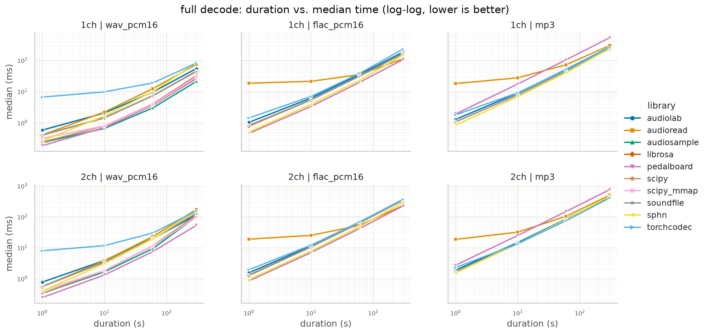
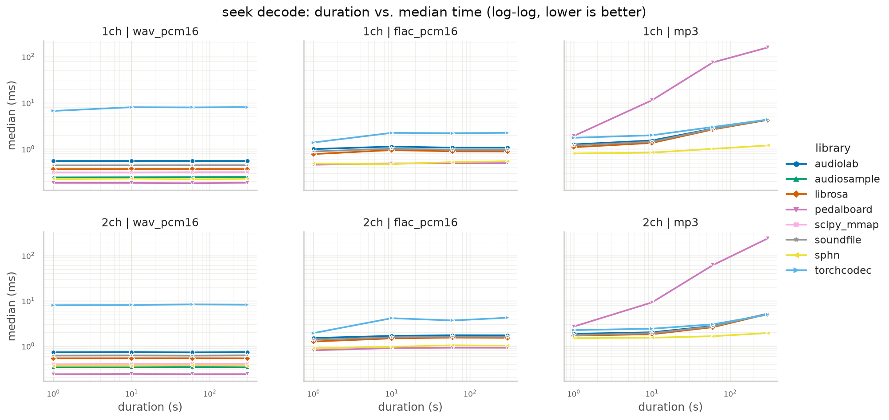

# Python Audio-Loading Benchmark

The aim of this repository is to evaluate the loading performance of various audio I/O packages interfaced from Python.

This is relevant for machine learning models that today often process raw (time domain) audio and assemble a batch on the fly. It is therefore important to load the audio as fast as possible. At the same time a library should ideally support a variety of uncompressed and compressed audio formats and also be capable of loading only chunks of audio (seeking). The latter is especially important for models that cannot easily work with samples of variable length (convnets).

Everything is loaded to a **`float32`, channels-first PyTorch tensor**, and every library's output is checked against a `soundfile` reference before its timing is allowed to count.

## Tested Libraries

| Library | Full-file | Seek | Notes |
| --- | --- | --- | --- |
| [`soundfile`](https://pysoundfile.readthedocs.io/) | yes | yes | libsndfile; the correctness reference |
| [`librosa`](https://librosa.org/) | yes | yes | `offset=`/`duration=` |
| [`scipy.io.wavfile`](https://docs.scipy.org/doc/scipy/reference/generated/scipy.io.wavfile.read.html) | yes | no | WAV only |
| `scipy.io.wavfile` (memmap) | yes | yes | WAV only; seek is a memmap slice |
| [`audioread`](https://github.com/beetbox/audioread) | yes | no | always yields 16-bit PCM |
| [`pedalboard`](https://github.com/spotify/pedalboard) | yes | yes | `AudioFile.seek` + `.read` |
| [`torchcodec`](https://github.com/pytorch/torchcodec) | yes | yes | `get_samples_played_in_range` |
| [`audiolab`](https://github.com/pengzhendong/audiolab) | yes | yes | PyAV-backed; `load_audio` |
| [`audiosample`](https://github.com/deepdub-ai/audiosample) | WAV only | yes | slice by seconds; its PyAV path is incompatible with PyAV 18 |
| [`sphn`](https://github.com/kyutai-labs/sphn) | yes | yes | Rust-backed; `sphn.read` |

A library qualifies if it installs with `uv` on Python 3.12 and imports cleanly. Every library is probed on each run; one that fails to load is reported with its error, never silently omitted.

### Not included

- **`aubio`**, **`soxbindings`** — `uv` cannot build either.
- **`torchaudio`** — since PyTorch 2.9 `torchaudio.load()` delegates to `torchcodec`, so it would report the same decoder twice.
- **`stempeg`** — shells out per call, so it measures process startup (~90–250 ms floor) rather than decoding.
- **`pydub`** — consistently at the back of the field, and has no seek API.
- **TensorFlow / `tensorflow_io`, plain numpy** — this benchmark is torch-only.

## Results

See [`results/report.md`](results/report.md) for the full tables, per-cell spread, and the measurement-noise floor of the run.





Differences smaller than the noise floor stated in the report are not rankings. Benchmarks are machine-specific — re-run on your own hardware rather than reading these as universal.

## Running the Benchmark

Install [`uv`](https://docs.astral.sh/uv/) and the `ffmpeg` binary (used to encode the MP3 corpus), then:

```shell
uv sync
uv run pabench all
```

That generates the corpus, runs both benchmarks, and writes the report and plots to `results/`. The steps are also available separately:

```shell
uv run pabench gen
uv run pabench run --out results/results.json --repeat 15
uv run pabench report --results results/results.json --out results/report.md
```

Useful flags: `--durations`, `--channels`, `--formats`, `--library` (repeatable), `--bench full|seek|both`, `--repeat`. `--corpus-dir` (or `PABENCH_CORPUS_DIR`) chooses where the corpus lives, so it can be generated on a specific disk.

A run refuses to start if any library failed to import, rather than publishing a report in which most cells read "unavailable". Pass `--allow-missing` to benchmark the rest anyway.

FFmpeg's shared libraries are located automatically for `torchcodec`; no environment setup is needed.

### What is measured

- **full** — decode the whole file.
- **seek** — decode 1 s from a fixed, seeded offset.

Corpus: 44.1 kHz, 1/10/60/300 s, mono and stereo, as 16-bit WAV, FLAC and MP3. Each timing is the median of N trials after one untimed warmup, against a warm page cache — the question is decode speed, not disk speed.

Correctness is gated per format: sample-exact for WAV and FLAC (within one LSB, since normalisation conventions differ between libraries), and a relaxed duration/RMS check for MP3, where decoders legitimately disagree about encoder delay. A library that fails has its timings withheld and the reason recorded.

`docs/refactor-design.md` has the full rationale.

## Development

```shell
uv sync --group test
uv run pytest
uv run ruff check . && uv run ruff format --check .
```

## Authors

@faroit, @hagenw

## Contribution

We encourage interested users to contribute to this repository in the issue section and via pull requests. Particularly interesting are notifications of new tools and new versions of existing packages.
