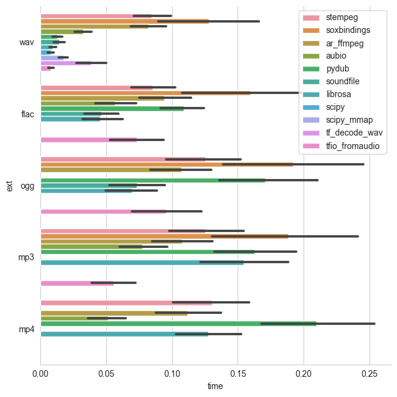

# Python Audio-Loading Benchmark

The aim of his repository is to evaluate the loading performance of various audio I/O packages interfaced from python.

This is relevant for machine learning models that today often process raw (time domain) audio and assembling a batch on the fly. It is therefore important to load the audio as fast as possible. At the same time a library should ideally support a variety of uncompressed and compressed audio formats and also is capable of loading only chunks of audio (seeking). The latter is especially important for models that cannot easily work with samples of variable length (convnets).

## Tested Libraries 

| Library                 | Short-Name/Code          | Out Type          | Supported codecs  | Excerpts/Seeking |
|-------------------------|-----------------------|-------------------|-------------------| -----------------|
| [scipy.io.wavfile](https://docs.scipy.org/doc/scipy-0.14.0/reference/generated/scipy.io.wavfile.read.html#scipy.io.wavfile.read)        | [`scipy`](https://github.com/faroit/python_audio_loading_benchmark/blob/master/loaders.py#L55)       | Numpy      | PCM (only 16 bit)   | ❌        |
| [scipy.io.wavfile memmap](https://docs.scipy.org/doc/scipy-0.14.0/reference/generated/scipy.io.wavfile.read.html#scipy.io.wavfile.read) | [`scipy_mmap`](https://github.com/faroit/python_audio_loading_benchmark/blob/master/loaders.py#L61)  | Numpy      | PCM (only 16 bit)   | ✅        |
| [soundfile](https://pysoundfile.readthedocs.io/en/0.9.0/) ([libsndfile](http://www.mega-nerd.com/libsndfile/))    | [`soundfile`](https://github.com/faroit/python_audio_loading_benchmark/blob/master/loaders.py#L50)   | Numpy   | PCM, Ogg, Flac | ✅             |
| [pydub](https://github.com/jiaaro/pydub)  | [`pydub`](https://github.com/faroit/python_audio_loading_benchmark/blob/master/loaders.py#L97) | Python Array |  PCM, MP3, OGG or other FFMPEG/libav supported codec | ❌ |
| [aubio](https://github.com/aubio/aubio)  | [`aubio`](https://github.com/faroit/python_audio_loading_benchmark/blob/master/loaders.py#L32) | Numpy Array | PCM, MP3, OGG or other avconv supported code |  ✅ |
| [audioread](https://github.com/beetbox/audioread) ([libmad](https://www.underbit.com/products/mad/))           | [`ar_mad`](https://github.com/faroit/python_audio_loading_benchmark/blob/master/loaders.py#L77) | Numpy Array | FFMPEG | ❌ |
| [audioread](https://github.com/beetbox/audioread) ([gstreamer](https://gstreamer.freedesktop.org/))         | [`ar_gstreamer`](https://github.com/faroit/python_audio_loading_benchmark/blob/master/loaders.py#L67) | Numpy Array | all of FFMPEG | ❌ |
| [audioread](https://github.com/beetbox/audioread) ([FFMPEG](https://www.ffmpeg.org/))            | [`ar_ffmpeg`](https://github.com/faroit/python_audio_loading_benchmark/blob/master/loaders.py#L87) | Numpy Array | all of FFMPEG | ❌ |
| [librosa](https://librosa.github.io/)             | [`librosa`](https://github.com/faroit/python_audio_loading_benchmark/blob/master/loaders.py#L104) | Numpy Array | relies on audioread |  ❌ |
| [tensorflow 1.13 `contrib.ffmpeg`](https://www.tensorflow.org/api_docs/python/tf/contrib/ffmpeg/decode_audio) | [`tf_decode`](https://github.com/faroit/python_audio_loading_benchmark/blob/master/loaders.py#L21) | Tensorflow Tensor | All codecs supported by FFMPEG |  ❌ |
| [torchaudio](https://github.com/pytorch/audio) | [`torchaudio`](https://github.com/faroit/python_audio_loading_benchmark/blob/master/loaders.py#L45) | PyTorch Tensor | all codecs supported by Sox |  ✅ |

### Not tested

* __[audioread (coreaudio)](https://github.com/beetbox/audioread/blob/master/audioread/macca.py)__: only available on macOS.
* __[madmom](https://github.com/CPJKU/madmom):__ same ffmpeg interface as `ar_ffmpeg`.
* __[tensorflow 2 `decode_wav`](https://www.tensorflow.org/versions/r2.0/api_docs/python/tf/audio/decode_wav):__ Not released yet.
* __[python builtin `wave`](https://docs.python.org/3.7/library/wave.html)__: TODO

## Results

The benchmark loads a number of (single channel) audio files of different length (between 1 and 151 seconds) and measures the time until the audio is converted to a tensor. Depending on the target tensor type (either `numpy`, `pytorch` or `tensorflow`) a different number of libraries were compared. E.g. when the output type is `numpy` and the target tensor type is `tensorflow`, the loading time included the cast operation to the target tensor. Furthermore, multiprocessing was disabled for data loaders that support them.

__All results shown below, depict loading time __in seconds__ for wav and mp3 files.__

### Numpy

### PyTorch

### Tensorflow

## Running the Benchmark

### Installation using Docker

Build the docker container using `docker build -t audio_benchmark .`, it installs all the package requirements for all audio libraries.

### Generate sample data

To test the loading speed, we generate different durations of random (noise) audio data and encode it either to __PCM 16bit WAV__, __MP3 CBR__, or __MP4__.
The data is generated by using a shell script. To generate the data in the folder `AUDIO`, run `generate_audio.sh`.

### Start Benchmark

Mount the data directory into the docker container and run `run.sh` inside the container. Afterwards, run `plot.py` to visualze the results.

