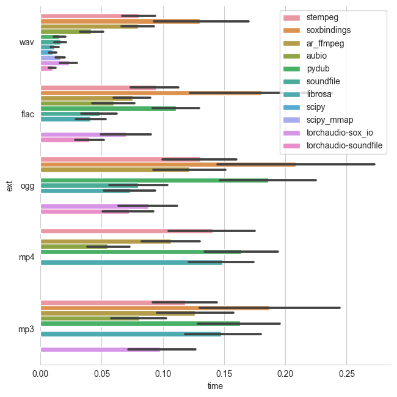

# Python Audio-Loading Benchmark

The aim of his repository is to evaluate the loading performance of various audio I/O packages interfaced from python.

This is relevant for machine learning models that today often process raw (time domain) audio and assembling a batch on the fly. It is therefore important to load the audio as fast as possible. At the same time a library should ideally support a variety of uncompressed and compressed audio formats and also is capable of loading only chunks of audio (seeking). The latter is especially important for models that cannot easily work with samples of variable length (convnets).

## Tested Libraries

| Library                                                                                                                                 | Version | Short-Name/Code  | Out Type          | Supported codecs                                    | Excerpts/Seeking |
| --------------------------------------------------------------------------------------------------------------------------------------- | ------- | ---------------- | ----------------- | --------------------------------------------------- | ---------------- |
| [scipy.io.wavfile](https://docs.scipy.org/doc/scipy-0.14.0/reference/generated/scipy.io.wavfile.read.html#scipy.io.wavfile.read)        | 1.7.1   | `scipy`          | Numpy             | PCM (only 16 bit)                                   | ❌               |
| [scipy.io.wavfile memmap](https://docs.scipy.org/doc/scipy-0.14.0/reference/generated/scipy.io.wavfile.read.html#scipy.io.wavfile.read) | 1.7.1   | `scipy_mmap`     | Numpy             | PCM (only 16 bit)                                   | ✅               |
| [soundfile](https://pysoundfile.readthedocs.io/en/latest/) ([libsndfile](http://www.mega-nerd.com/libsndfile/))                         | 0.10.0  | `soundfile`      | Numpy             | PCM, Ogg, Flac                                      | ✅               |
| [pydub](https://github.com/jiaaro/pydub)                                                                                                | 0.25.1  | `pydub`          | Python Array      | PCM, MP3, OGG or other FFMPEG/libav supported codec | ❌               |
| [aubio](https://github.com/aubio/aubio)                                                                                                 | 0.4.9   | `aubio`          | Numpy Array       | PCM, MP3, OGG or other avconv supported code        | ✅               |
| [audioread](https://github.com/beetbox/audioread) ([FFMPEG](https://www.ffmpeg.org/))                                                   | 2.1.9   | `ar_ffmpeg`      | Numpy Array       | all of FFMPEG                                       | ❌               |
| [librosa](https://librosa.github.io/)                                                                                                   | 0.8.1   | `librosa`        | Numpy Array       | relies on audioread                                 | ✅               |
| [tensorflow `tf.io.audio.decode_wav`](https://www.tensorflow.org/api_docs/python/tf/contrib/ffmpeg/decode_audio)                        | 2.6.0   | `tf_decode_wav`  | Tensorflow Tensor | PCM (only 16 bit)                                   | ❌               |
| [tensorflow-io `from_audio`](https://www.tensorflow.org/io/api_docs/python/tfio/v0/IOTensor#from_audio)                                 | 0.20.0  | `tfio_fromaudio` | Tensorflow Tensor | PCM, Ogg, Flac                                      | ✅               |
| [torchaudio](https://github.com/pytorch/audio) (sox_io)                                                                                 | 0.9.0   | `torchaudio`     | PyTorch Tensor    | all codecs supported by Sox                         | ✅               |
| [torchaudio](https://github.com/pytorch/audio) (soundfile)                                                                              | 0.9.0   | `torchaudio`     | PyTorch Tensor    | all codecs supported by Soundfile                   | ✅               |
| [soxbindings](https://github.com/pseeth/soxbindings)                                                                                    | 0.9.0   | `soxbindings`    | Numpy Tensor      | all codecs supported by Soundfile                   | ✅               |
| [stempeg](https://github.com/faroit/stempeg)                                                                                            | 0.2.3   | `stempeg`        | Numpy Tensor      | all codecs supported by FFMPEG                      | ✅               |
| [pedalboard.io.AudioFile](https://github.com/spotify/pedalboard)                                                                                            | 0.5.1   | `pedalboard`        | Numpy Array      | WAV, AIFF, MP3, OGG, FLAC        | ✅               |

### Not included

- **[audioread (coreaudio)](https://github.com/beetbox/audioread/blob/master/audioread/macca.py)**: only available on macOS.
- **[audioread (gstreamer)](https://github.com/beetbox/audioread/blob/master/audioread/gst.py)**: too difficult to install.
- **[madmom](https://github.com/CPJKU/madmom)**: same ffmpeg interface as `ar_ffmpeg`.
- **[pymad](https://github.com/jaqx0r/pymad)**: only support for MP3, also very slow.
- **[python builtin `wave`](https://docs.python.org/3.7/library/wave.html)**: too limited cocdec support.

## Results

The benchmark loads a number of (single channel) audio files of different length (between 1 and 151 seconds) and measures the time until the audio is converted to a tensor. Depending on the target tensor type (either `numpy`, `pytorch` or `tensorflow`) a different number of libraries were compared. E.g. when the output type is `numpy` and the target tensor type is `tensorflow`, the loading time included the cast operation to the target tensor. Furthermore, multiprocessing was disabled for data loaders. So especially for deep learning applications the loading speed doesn't necessarily reprent the batch loading speed.

**All results shown below, depict loading time **in seconds\*\*.

### Load to Numpy Tensor


### Load to PyTorch Tensor



### Load to Tensorflow Tensor


### Getting metadata information

In addition to loading the file, one might also be interested in extracting
metadata. To benchmark this we asked for every file to provide metadata for
_sampling rate_, _channels_, _samples_, and _duration_. All in consecutive
calls, which means the file is not allowed to be opened once and extract all
metadata together. Note, that we have excluded `pydub` from the benchmark
results on metadata as it was significantly slower than the other tools.


## Running the Benchmark

### Generate sample data

To test the loading speed, we generate different durations of random (noise) audio data and encode it either to **PCM 16bit WAV**, **MP3 CBR**, or **MP4**.
The data is generated by using a shell script. To generate the data in the folder `AUDIO`, run

```bash
generate_audio.sh
```

### Setting up using Docker

Build the docker container using

```bash
docker build -t audio_benchmark .
```

It installs all the package requirements for all audio libraries.
Afterwards, mount the data directory into the docker container and run `run.sh` inside the
container, e.g.:

```bash
docker run -v /home/user/repos/python_audio_loading_benchmark/:/app \
    -it audio_benchmark:latest /bin/bash run.sh
```

### Setting up in a virtual environment

Create a virtual environment, install the necessary dependencies and run the
benchmark with

```bash
virtualenv --python=/usr/bin/python3 --no-site-packages _env
source _env/bin/activate
pip install -r requirements.txt
pip install git+https://github.com/pytorch/audio.git
```

### Benchmarking

Run the benchmark with

```bash
bash run.sh
```

and plot the result with

```bash
python plot.py
```

This generates PNG files in the `results` folder.
The data is generated by using a shell script. To generate the data in the folder `AUDIO`, run `generate_audio.sh`.

## Authors

@faroit, @hagenw

## Contribution

We encourage interested users to contribute to this repository in the issue section and via pull requests. Particularly interesting are notifications of new tools and new versions of existing packages. Since benchmarks are subjective, I (@faroit) will reran the benchmark on our server again.
